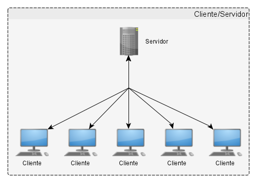
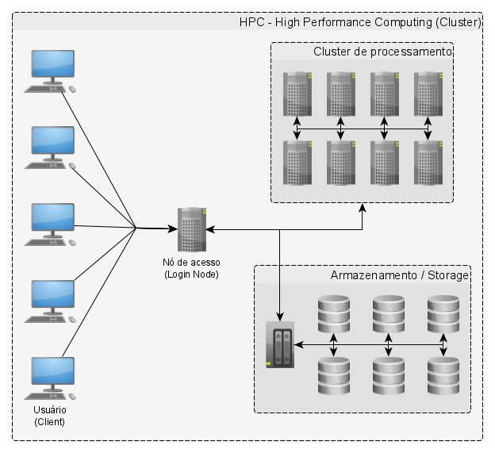

## Primeiros Passos

As atividades práticas serão, preferencialmente, executadas no servidor Darwin hospedado no Laboratório de Genética Humana e Molecular (LGHM/UFPA). Dessa forma, os alunos deverão acessar o servidor para ter acesso aos dados e recursos para execução das atividades.

### Servidor

Um **_servidor_** é um dos componentes de um modelo de computação distribuída denominado **_cliente/servidor_**. Esse modelo baseia-se na distribuição de funções entre dois tipos de processos independentes: o servidor e o cliente, estes podem residir em uma mesma máquina ou em diferentes computadores conectados através de uma rede. O cliente é qualquer processo que requisita um serviço ao servidor, sendo este último o responsável por ofertar e executar o processo. Para tal, uma aplicação ou usuário cliente envia uma mensagem ao servidor através da rede (local ou internet) requisitando ao servidor que execute uma determinada tarefa, os dados são então processados no servidor e após a execução, os resultados são retornados ao cliente. 

<p align="center">

</p>

As principais vantagens da arquitetura cliente/servidor são:

1) Todos os recursos são centralizados, dessa forma, o servidor é capaz gerenciar os recursos que são comuns a todos os usuários. (Por exemplo, evitando problemas de redundância ou conflito de dados).

2) Maior segurança, 

3) Níveis de acesso administrativo mais altos não são necessários e não estão disponíveis aos clientes.

4) Escalabilidade da rede, uma vez que é possível adicionar ou remover clientes sem afetar a operação da rede ou a necessidade de grandes alterações.

Dentre as desvantagens estão:

1) Maior custo de implementação e manutenção devido ao aumento da complexidade do sistema.

2) No caso de falha do servidor, os serviços estarão indisponíveis a todos os usuários.

3) No caso de falha da rede, os serviços não poderão ser acessados.

4) Se um cliente gera alto tráfego de rede ou consome muitos recursos, os demais clientes podem sofrer com alta latência (atraso na resposta).

### Cluster (HPC)

<p align="center">

</p>

Para processar dados de larga escala é necessário o uso de computadores ou grupos de computadores mais potentes que os computadores pessoais. O conjunto de servidores ligados através de uma rede rápida e atuando em conjunto é denominado **_cluster_** ou **_HPC_**. Cada computador integrando essa rede recebe o nome de nó (**_node_**). Os nós podem ter diferentes funções, por exemplo, existem os nós de conexão (**_login nodes_**) responsáveis por administrar as conexões e submissões de processo ao cluster, os nós de processamento (**_compute nodes_**) encarregados de processar os dados e os nós de armazenamento (**_storage_**) onde os dados são depositados e conservados. 

### Glossário de termos

#### Código ou programa

Lista de instruções consecutivas executadas em um computador. Código-fonte (_source code_) é o texto que constitui o programa (embora seja um arquivo de texto, a extensão ".txt" será substituída por aquela adequada à linguagem de programação utilizada, por ex., **Shell** = ".sh"; **Perl** = ".pl"; **Python** = ".py"; **R** = ".R").

Para executar um programa, iremos utilizar o **_interpretador_** correspondente à linguagem utilizada. Esse interpretador será responsável por ler e executar a sequência de comandos contidas no arquivo executável - embora um programa possa conter um ou mais arquivos de código associados, apenas um será responsável por iniciar e coordenar a execução das instruções contidas no programa.

#### Algoritmo

A receita dos passos (ou instruções) de um programa é denominada **_algoritmo_**. Em algumas situações, os algoritmos são praticamente indistinguíveis do código do programa, em outras, especialmente em programas complexos, é recomendado escrever um algoritmo antes de desenvolver um programa. Isso porque a linguagem de algoritmos costuma ser mais simples, compacta e próxima da linguagem humana, simplificando o processo de desenvolvimento. Além disso, algoritmos são portáveis, podendo ser implementados em diferentes linguagens de programação.

Um exemplo de algoritmo:

```bash
inicializar as variáveis a e z
Definir o valor das variáveis a e z
Imprimir os valores de a e z na tela
```

A **_implementação_** do algoritmo é o processo de escrever o algoritmo usando uma linguagem de programação e testá-lo. A etapa de testes e verificação dos resultados é essencial para assegurar que as instruções foram definidas corretamente e que os resultados estão corretos. Essa etapa é crítica e não deve ser menosprezada.

> Sempre verifique se os dados de entrada e os de saída correspondem ao esperado e jamais assuma que se o programa foi executado com êxito, os resultados estão corretos.

> No desenvolvimento de programas complexos, dê preferência ao desenvolvimento modular e teste o código após a implementação de cada rotina, isso facilita o processo de implementação e a depuração de erros.

Os erros na implementação do programa são comumente chamados de **_bugs_** e o processo de encontrá-los e corrigi-los é denominado **_debugging_**.

#### GNU/Linux

**_Unix_** é um **sistema operacional** em desenvolvimento desde os anos 1960. É constituído por uma suíte de aplicativos (programas) que permitem o funcionamento do computador. É um sistema estável, multiusuário e multitarefa utilizado em diferentes tipos de computadores, desde computadores pessoais até HPCs e dispositivos eletrônicos.

Atualmente, há uma grande variedade de versões derivadas do sistema Unix, sendo as variedades mais populares: Sun Solaris, MacOS X e GNU/Linux.

Os sistemas operacionais GNU/Linux são formados pelo kernel Linux, por programas acessórios GNU e o **_shell_**. 

O **_Kernel_** é responsável pelo gerenciamento dos processos e realiza a alocação de recursos - tais como memória, processamento e acesso ao sistema de arquivos para a execução das tarefas.

#### Shell

Atua como uma interface entre o usuário e o kernel. A cada conexão de um usuário, o programa de acesso verifica as credenciais de acesso (geralmente, login e senha) e então inicia a interface por linha de comando (CLI). Após iniciado, o Shell é responsável por interpretar os comandos inseridos pelo usuário e providenciar para que sejam executados. Quando um comando é submetido ao shell, este não estará disponível a novos comandos até que a tarefa em execução termine e os resultados sejam apresentados no terminal.

O shell pode ser customizado pelo usuário e existem diferentes versões de shell, sendo uma das mais populares o **_BASH_** (Bourne-Again Shell).

> Um dos recursos disponibilizados pelo Shell é o de autocompletar. Através desse recurso, ao iniciar a digitação do nome de um programa, arquivo ou diretório e digitar a tecla `TAB`, o Shell irá completar o nome automaticamente. Nos casos onde houver mais de uma opção disponível para autocompletar, apertar a tecla `TAB` duas vezes imprimir todos os nomes que correspondem à sequência digitada.

> Outro recurso do Shell é o histórico de comandos (**_History_**), através deste recurso o Shell armazena os comandos executados, sendo possível acessá-los novamente através das setas para cima e para baixo, através do comando `history` ou consultando o arquivo .bash_history.

> Boa parte dos programas de bioinformática são executados através do Shell ou **_prompt de comando_**.

## Logando no servidor Darwin

Para logar a um servidor (ou cluster) é necessário ter uma conta constituída por um nome de usuário e senha. No contexto desta disciplina, contas foram criadas para cada um dos alunos e os respectivos usuários e senhas de acesso disponibilizados individualmente.

### Ferramentas de acesso ao servidor

#### Usuários do sistema operacional Windows

Os usuários do sistema operacional Windows poderão utilizar diferentes formas de acesso ao servidor, tais como, aplicativo [**Putty**](https://www.putty.org/), [**Git Bash**](https://gitforwindows.org/), [**_Bash for Windows_**](https://livreeaberto.com/instalando-bash-no-windows) e [**_Bitvise SSH Client_**](https://www.bitvise.com/ssh-client-download). Qualquer forma de acesso pode ser utilizada no contexto da disciplina, entretanto, na primeira aula nos restringimos ao acesso através da ferramentas Bitvise SSH.

#### Usuários do sistema operacional Mac OS

Os usuários do sistema operacional Mac OS podem recorrer ao aplicativo **Terminal** para executar as tarefas no servidor remoto. Para acessar o servidor remoto, devem utilizar o comando **_SSH_** (explicado abaixo).

#### Usuários de sistemas operacionais GNU/Linux

O acesso ao servidor pode ser realizado através do comando **_SSH_**. O SSH (_Secure Socket Shell_) é um protocolo que permite ao usuário se conectar de maneira segura a um computador remoto usando uma interface por linha de comando (CLI). Assim que a conexão é aprovada, uma sessão do Shell é iniciada e o usuário está apto a submeter comandos através do cliente.

```bash
username@host:~$ ssh
usage: ssh [-1246AaCfGgKkMNnqsTtVvXxYy] [-b bind_address] [-c cipher_spec]
[-D [bind_address:]port] [-E log_file] [-e escape_char]
[-F configfile] [-I pkcs11] [-i identity_file]
[-J [user@]host[:port]] [-L address] [-l login_name] [-m mac_spec] [-O ctl_cmd] [-o option] [-p port] [-Q query_option] [-R address] [-S ctl_path] [-W host:port] [-w local_tun[:remote_tun]]
[user@]hostname [command]
```

### Acesso ao servidor

> Os passos (1 a 3) são necessários para os usuários de sistemas operacionais Mac OS e GNU/Linux ou usuários do Windows usando os aplicativos **Git Bash** e **Bash for Windows**. Usuários do Windows usando os programas **Putty** e do **Bitvise SSH** serão automaticamente redirecionados para o Shell do servidor remoto após o login pela interface gráfica.

Para conectar ao Darwin, as seguintes etapas devem ser seguidas:

1. Digite o comando `ssh` no prompt de comando seguido por um espaço em branco e então digite o nome de usuário (_username_) seguido por `@200.239.101.201`. Não há espaços entre o nome de usuário e o símbolo de arroba `@`.

```bash
ssh <nome_usuário>@200.239.101.201
```

Exemplo de uso para o usuário giordano:


2. Pressione `Enter` ou `Return` e você será requisitado a inserir a sua senha.


> Ao digitar a senha, o cursor não irá se mover, tal situação é normal e indica que o computador está recebendo e transmitindo a senha digitada ao computador remoto.

> Caso você queira apagar o conteúdo digitado durante esta etapa, é possível utilizar o atalho `Ctrl` + `U` (não funciona em todos os terminais).

3. Caso esta seja a primeira conexão entre o cliente e o servidor, uma mensagem de aviso aparecerá perguntando se você deseja prosseguir com a conexão. Digite `y` ou `yes` para prosseguir com a conexão.


Então, você deverá receber uma mensagem indicando o sucesso da conexão e o **prompt de comando** do servidor estará liberado para receber comandos.


```bash
[giordano@darwin:~]$
```
O prompt de comando indica o nome do usuário `giordano` e do servidor ou nó `darwin` ao qual o usuário se conectou. 

> O caracter `$` indica que o shell está liberado para aceitar comandos. Dessa forma, toda vez que um comando for executado ele desaparecerá e só retornará quando a execução for finalizada.

### Copiando arquivos do diretório de dados

Uma vez que estamos conectados ao servidor, a primeira tarefa é checar se há algum arquivo na pasta local. Toda vez que você se conecta a um servidor, você será direcionado à uma pasta específica designada ao seu usuário `home folder`. Essa pasta terá o nome do seu usuário e estará contida em uma pasta contendo os `homes` de todos os usuário. A localização da pasta home será indicada por `/home/<username>/` (por ex. `/home/giordano/`).

Para listar todo o conteúdo de um diretório podemos utilizar o comando `ls`:

```bash
$ ls
```
Ao executar esse comando, nenhum arquivo será mostrado uma vez que a pasta encontra-se vazia.

Para preenchê-la vamos utilizar o comando `cp` para copiar os arquivos que estão depositados em uma outra pasta no servidor. Para tal, digite (ou copie) o comando a seguir (incluindo o ponto):

```bash
$ cp -r /data/2022_shell_script/unix_lesson/ .
```
> O comando `cp` é utilizado para copiar arquivos e diretórios. Ele requer que o usuário especifique a localização do item a ser copiado `/data/2022_shell_script/unix_lesson/` e o destino dele `.`. A opção `-r` é utilizada para garantir a cópia recursiva dos arquivos presentes na pasta a ser copiada, em geral, é utilizada quando se copia diretórios e os arquivos e subdiretórios contidos nele. A cópia simples de um arquivo não requer o parâmetro `-r`. Já o ponto `.` denota ao sistema a localização atual, ou seja, a pasta onde o usuário se encontra no momento.

Após a utilização do comando `cp`, vamos verificar se os dados foram copiados adequadamente.

```bash
$ ls
```
Se foram copiados adequadamente, você deverá ver o nome da pasta `unix_lesson` escrita no terminal.


> O comando `ls` significa "**l**i**s**t" e lista todo o conteúdo de um diretório.

## Explorando o Shell

Vamos explorar com maior detalhe o conteúdo da pasta `unix_lesson`. Para tal, devemos alterar o diretório onde estamos localizados e podemos realizar essa ação usando o comando `cd` que significa `change directory`.

```bash
$ cd unix_lesson
```
Note que há uma alteração no prompt de comando. O caracter `~` foi substituído pelo nome da pasta `unix_lesson`. Isso indica que houve êxito na mudança de diretório e que agora estamos dentro da pasta `unix_lesson`.

Podemos novamente utilizar o comando `ls`para listar o conteúdo do diertório.

```bash
$ ls
```
Após a execução, você verá o seguinte conteúdo:

```bash
$ ls

genomics_data  other  raw_fastq  README.txt  reference_data
```


### Argumentos

Há cinco elementos listados pelo comando `ls`, entretanto, além do nome de cada um deles, não temos informações sobre o tipo, por exemplo, se são arquivos ou pastas.

Para ter mais informações sobre os elementos contidos na pasta podemos usar algumas opções do comando `ls`.

```bash
$ ls -F

genomics_data/  other/  raw_fastq/  README.txt  reference_data/
```


Os elementos que possuem uma barra `/` ao final do nome são diretórios. Elementos com um asterisco `*` ao final do nome são programas. Se os nomes se mativerem sem nenhuma adição, são arquivos de texto comum.

A opção `-l` correspondente ao formato de listagem "longo" possibilita obter informações ainda mais detalhadas dos elementos presentes na pasta.

```bash
$ ls -l
```

```
total 20
drwxr-xr-x 2 giordano giordano 4096 May  6 20:40 genomics_data
drwxr-xr-x 2 giordano giordano 4096 May  6 20:40 other
drwxr-xr-x 2 giordano giordano 4096 May  6 20:40 raw_fastq
-rw-r--r-- 1 giordano giordano  377 May  6 20:40 README.txt
drwxr-xr-x 2 giordano giordano 4096 May  6 20:40 reference_data
```


Cada linha do ouput representa um arquivo ou diretório. As linhas correspondentes aos diretórios são iniciadas com um `d`. 

É possível combinar vários argumentos em um mesmo comando, por exemplo, é possível usar os parâmetros `-l` e `-F` conjunto da seguinte maneira:

```bash
ls -lF
```

Qual é a alteração ocorrida no _output_?

<details>
  <summary><i>Explicação</i></summary>
  <P>Note que os diretórios agora contém uma barra <code>/</code> ao final dos nomes.</P>
  
</details>

> Todos os comandos são essencialmente programas habilitados a realizar uma tarefa específica.

A maior parte dos programas pode receber argumentos adicionais para controlar o comportamento de execução, alguns deles terão como **_inputs_** nomes de arquivos ou diretórios. Para saber quais são os argumentos apropriados ou possíveis para um programa podemos recorrer aos manuais. A maior parte dos comandos usuais do Shell possuem um manual que pode ser acessado através do comando `man`. Vamos testá-lo com o comando `ls`:

```bash
$ man ls
```
A execução desta instrução irá abrir o manual do comando `ls` e você perderá, momentaneamente, o acesso ao prompt de comando. Você será redirecionado à página _buffer_, onde você deverá navegar através de teclas de atalho do teclado:

* tecla de 'espaço' para avançar
* tecla `b` para retornar
* Setas de para `cima` e para `baixo` para avançar e retornar, respectivamente.

> Para sair da página do manual do comando `ls` e retornar ao prompt de comando, você deve pressionar a tecla `q` (_quit_).

***

**Exercício 1**

* Abra a página de manual do comando `find`. Verifique algumas das informações. 
    * Você acredita que é possível decorar todas as informações contidas no manual? 
    * Você acredita que esse formato de informação é útil para você?
    
* Saia do manual de `find` e retorne ao prompt de comando.  

> Comandos de Shell podem ser extremamente complicados e é impossível saber como usar todas as opções de cor. Então, provavelmente, você terá que recorrer muitas vezes ao manual ou a ajuda do programa.

> O manual das ferramentas também podem ser acessados online. Aprenda a utilizar as buscas na internet para auxiliá-lo no uso dos programas. Além de obter informações sobre os argumentos, você também pode encontrar bons exemplos na internet; ***Google é seu amigo.***

***

## A estrutura do sistema de arquivos do Unix

Vamos aprender a nos mover um pouco através dos diretórios do servidor. Que tal irmos ao diretório `raw_fastq` e investigar o que há dentro dele?

```bash
$ cd raw_fastq/

$ ls -l
```


Uma vez que aprendemos como acessar alguns diretórios através do comando `cd`, seria interessante aprendermos a nos localizar em relação aos demais diretórios do servidor.

### O diretório raiz "root"

Assim como qualquer outro computador, a estrutura de arquivos no GNU/Linux é hierárquica, o diretório raiz `"/"` é denominado `root` e é o ponto de início de uma estrutura que se assemelha a uma árvore invertida.

|  |
|:--:|
| <b>Estrutura do sistema de arquivos. Fonte: Linux.com - The Linux Filesystem Explained</b>|

> O diretório root é representado apenas pela barra `/`. 

### Caminhos `Paths`

Agora vamos aprender um pouco mais sobre os "endereços" dos diretórios, conhecidos como **_path_** e nos movimentar pelo sistema de arquivos.

Primeiro vamos checar em que diretório estamos. O prompt de comando indica em que diretório estamos, mas não nos fornece informação sobre onde está a pasta `raw_fastq` em relação à nossa pasta `home` ou ao diretório `"/"`.

O comando para checar qual é a nossa atual localização é o `pwd`, este não necessita de argumentos adicionais e nos retorna o caminho do seu direório atual, ou em inglês, do **p**resent **w**orking **d**irectory.

```bash
$ pwd
```
No resultado retornado, cada pasta é separada das pastas superiores e inferiores hierarquicamente por uma `"/"` que se incia no diretório raiz (_root_). Agora você é capaz de se localizar em relação ao diretório **_root_**.

Mas e qual é o seu diretório pré-designado? Não importa em qual pasta você esteja no momento, ao digitar apenas o comando `cd` você será redirecionado ao seu diretório `home`. 

```bash
$ cd
```

Qual é o seu diretório atual?

```bash
$ pwd
```

Isso deve retornar uma cadeia de diretórios iniciada com o _root_. Esse é o endereço completo do seu diretório `home`, também conhecido como caminho absoluto ou "**full path**". O caminho absoluto refere-se ao fato de que o endereço inicia-se na pasta _root_ e que você sabe onde está em relação à pasta raiz..**

Verifique o seu prompt de comando, ele mostra qual é o nome do diretório atual (seu nome do usuário)?

* Não, ele não mostra. Ao invés disso, aparece o símbolo `~`. *

O que isso significa?

*Isso ocorre porque `~` corresponde ao caminho absoluto até o diretório base do usuário.*

Então podemos digitar apenas `~` ao invés de `/home/<username>/`?

*Sim, podemos!*

#### Usando _Paths_ com comandos

Você pode fazer muito mais com a ideia de juntar diretórios *pai/filho*. Digamos que queremos ver o conteúdo da pasta `raw_fastq`, mas a partir do diretório atual (inicial). Podemos usar o comando `list` e digitar o caminho para a pasta que queremos examinar!

```bash
$ cd

$ ls -l ~/unix_lesson/raw_fastq
```
E se quisermos mudar o diretório de `~` (_home_) para `raw_fastq` em uma única etapa?

```bash
$ cd ~/unix_lesson/raw_fastq
```

Note que foi possível mover dois níveis de diretório com apenas um comando.

E se quisermos voltar para cima, sair para um nível acima do diretório `raw_fastq`? Podemos apenas digitar `cd unix_lesson`? Experimente e veja o que acontece.

*Infelizmente, isso não funcionará porque quando você diz `cd unix_lesson`, o shell está procurando por uma pasta chamada `unix_lesson` dentro do seu diretório atual, ou seja, `raw_fastq`.*

Você consegue pensar em uma alternativa?

*Você pode usar o caminho absoluto para a pasta unix_lesson!*

```bash
$ cd ~/unix_lesson
```

****

**Exercício 2**

1. Mova-se até o seu diretório base (_home_).
2. Agora, liste o conteúdo do diretório `reference_data` que está dentro da pasta `unix_lesson`.

****

#### A tecla `TAB` (autocompletar)

Digitar nomes de diretórios completos pode ser demorado e propenso a erros. Uma maneira de evitar isso é usar o **autocompletar**. A tecla `tab` está localizada no lado esquerdo do seu teclado, logo acima da tecla `caps lock`. Quando você começa a digitar os primeiros caracteres de um nome de diretório e, em seguida, pressiona a tecla `tab`, o Shell tentará preencher o restante do nome do diretório.

Por exemplo, primeiro digite `cd` para voltar ao `home`, depois digite `cd uni`, e a seguir pressione a tecla `tab`:

```bash
$ cd
$ cd uni<tab>
```

O shell preencherá o restante do nome do diretório para `unix_lesson`.

Agora, vamos para `raw_fastq`, digite `ls Mov10_oe_`, e a seguir pressione a tecla `tab` uma vez:

```bash
$ cd raw_fastq/
$ ls Mov10_oe_<tab>
```
**Nada acontece!!**

A razão é que existem vários arquivos no diretório `raw_fastq` que começam com `Mov10_oe_`. Dessa forma, o shell não sabe qual usar para preencher. Quando você pressionar `tab` uma segunda vez, o shell listará todas as opções possíveis.

```bash
$ ls Mov10_oe_<tab><tab>
```

Agora você pode selecionar um arquivo de interesse, digitando o número `1` e pressionando `tab` novamente para preencher o nome completo do arquivo.

```bash
$ ls Mov10_oe_1<tab>
```

> **IMPORTANTE:** o preenchimento a partir do autocompletar `tab` também pode preencher nomes de comandos. Por exemplo, digite `e<tab><tab>`. Você verá o nome de cada comando que começa com um `e`. Um deles é o `echo`. Se você digitar `ech<tab>`, verá que o autocompletar funciona.

**A tecla `TAB` é sua amiga!** Ela ajuda a evitar erros de ortografia e acelera o processo de digitação do comando completo. Recomendamos que você use isso ao trabalhar na linha de comando.

### Caminho relativo **_relative paths_**

Falamos sobre caminhos **absolutos** até agora, mas existe uma maneira de especificar caminhos para pastas e arquivos sem ter que se preocupar com o diretório raiz. E você já usou isso antes quando estávamos aprendendo sobre o comando `cd`.

Vamos mudar os diretórios de volta para o nosso diretório `home`, e mais uma vez mudar os diretórios de `~` (_home_) para `raw_fastq` em uma única etapa. (*Sinta-se à vontade para usar o preenchimento de guias para concluir seu caminho!*)

```bash
$ cd
$ cd unix_lesson/raw_fastq
```
Desta vez não estamos usando o `~/` antes do `unix_lesson`. Neste caso, estamos usando um caminho relativo, relativo à nossa localização atual - onde sabemos que `unix_lesson` é uma pasta filha em nossa pasta pessoal, e a pasta `raw_fastq` está dentro de `unix_lesson`.

> Anteriormente havíamos utilizado o seguinte comando:
> ```bash
> $ cd ~/unix_lesson/raw_fastq
> ```

Há também um atalho útil para o caminho relativo para um diretório pai, o uso de 2 pontos `..`. Digamos que queremos passar da pasta `raw_fastq` para sua pasta pai.

```bash
cd ..
```
Agora você deve estar no diretório `unix_lesson` (verifique o prompt de comando ou execute `pwd`).

> Você aprenderá um pouco mais sobre o atalho `..` mais tarde. Você consegue pensar em um caso no qual esse atalho não funcionará?
>
> <details>
> <summary>Resposta</summary>
> <P>Quando você está no diretório raiz, já que não há pai para o diretório raiz!</P>
> </details>

Ao usar caminhos relativos, você pode precisar verificar quais são as ramificações abaixo da pasta em que você está. Existe um comando muito útil (`tree`) que pode ajudá-lo a ver a estrutura de qualquer diretório.

```bash
$ tree
```

Se você estiver ciente da estrutura de diretórios, poderá encadear uma longa lista de diretórios usando caminhos **relativos** ou **absolutos**.

#### Resumo de caminhos absolutos versus caminhos relativos

**Um caminho absoluto sempre começa com um `/`, um caminho relativo não.**

Um caminho relativo é como obter direções de alguém na rua. Alguém diz para você "virar à direita na placa de Pare e depois virar à esquerda na Rua Um". Isso funciona muito bem se você estiver no local, mas não tão bem se você estiver tentando explicar a alguém como chegar lá de a partir de outro local. Um caminho absoluto é como as coordenadas de GPS. Ele diz exatamente onde algo está, não importa onde você esteja agora.

Normalmente, você pode usar um caminho completo ou um caminho relativo, dependendo do que for mais conveniente. Se estivermos no diretório inicial, é mais conveniente inserir apenas o caminho relativo, pois envolve menos digitação.

Com o tempo, ficará mais fácil para você manter uma nota mental da estrutura dos diretórios que você está usando e como navegar rapidamente entre eles.

## Copiando, criando, movendo e removendo dados

Agora já sabemos como nos mover dentro da estrutura de diretórios usando a linha de comando. Mas e se quisermos copiar arquivos, movê-los de um diretório para outro, ou renomeá-los?

Vamos para o diretório `raw_fastq`, que contém alguns arquivos fastq que são a saída do sequenciamento.

```bash
cd ~/unix_lesson/raw_fastq
```
> Esses arquivos são chamados de **raw data** ou **dados brutos**, pois não foram alterados desde a sua criação.

### Copiando

Vamos usar o comando _copy_ (`cp`) para fazer uma cópia do arquivo `Mov10_oe_1.subset.fq` presente nesta pasta e nomear o arquivo copiado de `Mov10_oe_1.subset-copy.fq`. O comando copy tem a seguinte sintaxe:

`cp caminho/para/item-sendo-copiado caminho/para/novo-item-copiado`

Neste caso, como os arquivos estão em nosso diretório atual, só precisamos especificar o nome do arquivo que está sendo copiado, seguido do nome que desejamos dar ao arquivo cópia.

```bash
$ cp Mov10_oe_1.subset.fq Mov10_oe_1.subset-copy.fq

$ ls -l
```
O comando `copy` também pode ser usado para copiar diretórios inteiros, mas o argumento `-r` deve ser adicionado após o comando `cp`. O `-r` significa copiar recursivamente tudo do diretório e seus subdiretórios." [Nós o usamos anteriormente quando copiamos o diretório `unix_lesson` para nossos diretórios pessoais]().

### Criando

Agora, vamos criar um diretório chamado `fastq_backup` e mover a cópia do arquivo fastq para esse novo diretório.

O comando `mkdir` é usado para criar um diretório, sintaxe: `mkdir nome-da-pasta-a-ser-criada`.

```bash
$ mkdir fastq_backup
```

> **IMPORTANTE** Nomes de arquivos/diretórios/programas com espaços não funcionam bem no GNU/Linux, logo use caracteres como hífens ou sublinhados. Usar sublinhados em vez de espaços é chamado de "snake_case". Alternativamente, algumas pessoas optam por pular espaços e apenas capitalizar a primeira letra de cada nova palavra (ou seja, MyNewFile). Essa técnica alternativa é chamada de "CamelCase".


### Movendo

Agora podemos mover a cópia do nosso arquivo fastq para o novo diretório. Para tal, utilizamos o comando move, `mv`, sintaxe: 

`mv caminho/para/item-sendo-movido caminho/para/destino`

Nesse caso, podemos usar caminhos relativos e apenas digitar o nome do arquivo e da pasta.

```bash
$ mv  Mov10_oe_1.subset-copy.fq  fastq_backup
```

Vamos verificar se o comando `mv` funcionou como planejado:

```bash
$ ls -l fastq_backup
```

### Renomeando

O comando `mv` tem uma segunda funcionalidade, a qual você pode usar para renomear arquivos. A sintaxe é idêntica a quando usamos `mv` para mover, mas desta vez em vez de passar um diretório como destino, apenas passamos um novo nome como destino.

Vamos experimentar esta funcionalidade!

O nome Mov10_oe_1.subset-copy.fq não é muito informativo, queremos ter certeza de que temos a palavra "backup" nele para não excluí-lo acidentalmente.

```bash
$ cd fastq_backup

$ mv  Mov10_oe_1.subset-copy.fq   Mov10_oe_1.subset-backup.fq

$ ls
```

> **Dica** - Você pode usar `mv` para mover um arquivo e renomeá-lo ao mesmo tempo!

**Observações importantes sobre `mv`**:
* Ao usar `mv`, o shell **não** perguntará se você tem certeza de que deseja "substituir o arquivo existente" ou mensagem similar, a menos que você use a opção `-i`.
* Uma vez substituído, não é possível recuperar o arquivo substituído!

### Removendo

Descobrimos que não precisamos criar backups de nossos arquivos fastq manualmente, pois backups foram gerados por nosso colaborador, dessa forma, com o intuito de economizar espaço no servidor, vamos excluir o conteúdo da pasta `fastq-backup` e a própria pasta.

```bash
$ rm  Mov10_oe_1.subset-backup.fq
```

**Considerações importantes sobre `rm`**
* `rm` remove/exclui permanentemente o arquivo/pasta.
* Não há o conceito de "Lixeira" na linha de comando. Quando você usa `rm` para remover/excluir, eles realmente desaparecem.
* **Tenha muito cuidado com este comando!**
* Você pode usar o argumento `-i` se quiser perguntar antes de remover, `rm -i <nome do arquivo>`.

Vamos excluir a pasta fastq_backup. Primeiro, teremos que navegar até o diretório pai pois não podemos excluir a pasta em que estamos atualmente ou usando.

```bash
$ cd ..

$ rm  fastq_backup 
```
O comando funcionou? Você obteve um erro?

<details>
  <summary><i>Explicação</i></summary>
  <P>Por padrão, <code>rm</code> **NÃO** irá deletar diretórios, mas você pode usar a opção <code>-r</code> se estiver certo que deseja apagar o diretório e todo o seu conteúdo. Como precaução, utilize este comando com a opção <code>-i</code>.</P>
</details><br>

```bash
$ rm -ri fastq_backup
```

- `-r`: recursivo, opção usada comumente quando se trabalha com diretórios, por exemplo, com `cp`. 
- `-i`: prompt antes de cada remoção.

***

**Exercício 3**

1. Crie uma nova pasta em `unix_lesson` chamada `selected_fastq`
2. Copie os arquivos `Irrel_kd_2.subset.fq` e `Mov10_oe_2.subset.fq` de `raw_fastq` para a pasta `~/unix_lesson/selected_fastq`
3. Renomeie a pasta `selected_fastq` e a nomeie de `exercise1`

***

## Comandos

```
cd          # altera o diretório
ls          # lista o conteúdo
man         # manual para o comando
pwd         # verifica o diretório de trabalho atual
tree        # imprime a estrutura de arquivos do diretórioa
cp          # copia
mkdir       # cria um novo diretório
mv          # move ou renomeia arquivos e diretórios 
rm          # remove/exclui
```

## Atalhos

```
~           # diretório inicial (usuário)
.           # diretório atual
..          # diretório pai
```

---
**Bibliografia / Fontes**

BASH programming: https://tldp.org/HOWTO/Bash-Prog-Intro-HOWTO.html 

BASH for Genomics: https://angus.readthedocs.io/en/2016/GenomicsShell.html 

GNU/Linux tutorials: https://www.debian.org/doc/manuals/debian-reference/ch01.en.html 

Jargas, Aurelio Marinho. Shell Script Profissional. São Paulo : Novatec Editora, 2008.

Langtangen, H. P. (2016). A Primer on Scientific Programming with Python (5th edition 2016.). Springer Berlin Heidelberg : Imprint: Springer.

*The materials used in this lesson were derived from work of members of the teaching team at the [Harvard Chan Bioinformatics Core (HBC)](http://bioinformatics.sph.harvard.edu/). These are open access materials distributed under the terms of the [Creative Commons Attribution license](https://creativecommons.org/licenses/by/4.0/) (CC BY 4.0), which permits unrestricted use, distribution, and reproduction in any medium, provided the original author and source are credited.*

* *The materials used in this lesson were derived from work that is Copyright © Data Carpentry (http://datacarpentry.org/). 
All Data Carpentry instructional material is made available under the [Creative Commons Attribution license](https://creativecommons.org/licenses/by/4.0/) (CC BY 4.0).*
* *Adapted from the lesson by Tracy Teal. Original contributors: Paul Wilson, Milad Fatenejad, Sasha Wood and Radhika Khetani for Software Carpentry (http://software-carpentry.org/)*
